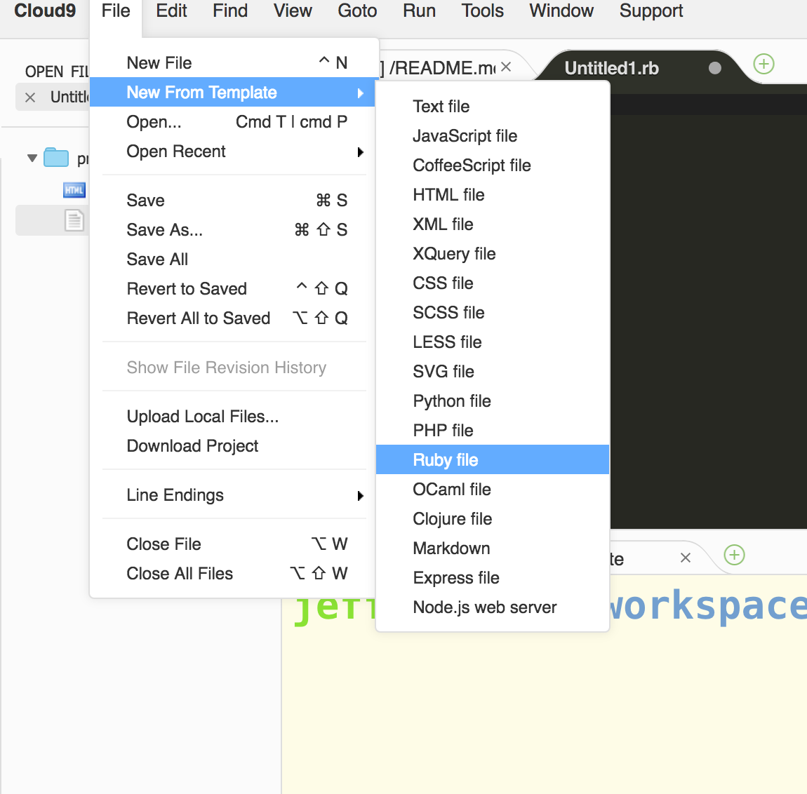

# Why ruby?

Ruby and other programming languages allow us to write logic such that we do not need to always hard code our webpages with information.  Instead we can use logic to produce an output.

# Be something and do something 

There are really just two things any programming language is involved with: being something and doing something.  For being something we use variables, and for doing something we use methods.

```html
<h1>New York Rangers</h1>
<h2> Centers </h2>
<p>Oscar Lindberg</p>
<p>J.T. Miller</p>
<h2> Left Wings </h2>
<p>Pavel Buchnevich</p>
<p>Tanner Glass</p>
```

### Variables: Being Something

If we consider information that is something: first names.  

We can let something just be, by simply creating something once and then placing it in a location on the computer, so we know where to access it.  Let's place the name "Oscar" in our computer.   

1. From your workspace, open up the ruby console at the bottom of your screen.  You do this by clicking on the part in yellow, typing the letters "irb" and then pressing enter.  You are now free to write ruby.  


Here is how we type in some text.

```ruby
"Oscar"
```

You start any text with quotation marks, and this is called a String.  Now what we said previously is that this lived in a location in memory, so let's see where that location is.

Type in the following: 

```ruby
"Oscar".object_id
```

That is the **memory address** of the string that you just typed in.  Now because we don't want to remember an address like this, we instead name give a name to this location, and we can name that location any lowercase collection of characters that we like. 

```ruby
@first_name = "Oscar"
```

Now how would you read something like this?  Have the word `first_name` point to a location in memory, where we are storing the string `"oscar"`.  You can get to that location in memory now, simply by typing in `first_name`.  Ruby will go to that location, and show you what is located there.  Type in the word first_name into your console and press enter.


Ok, so now on your own create a different variable called last_name, and have it point to the location in memory that holds the string `"Lindberg"`.

We still have this remaining question of how we get this to work with our HTMl.  We'll get there, but first let's finish off the next thing that programming language can do.

### Methods: Doing something

So we saw that variables can be something, and we used that to create two variables `first_name` and `last_name`.  Now what we would like to do is add these two variables together.

Let's do that with the plus sign.

```ruby
@first_name + @last_name
=> "Oscar Lindberg"
```

What we would really like to do, is to have a way to refer to this procedure so that we can execute it as many times as we would like.  That's were we use a method.

```ruby
def full_name
	@first_name + @last_name
end
``` 

After declaring the method like above.  Now type in `full_name` and see what happens.

```ruby
full_name
=> "Oscar Lindberg"
```

Methods are a little more complicated than variables, so let's make sure that we cover all of the components of defining a new method.  We always need the following:

1. The def keyword
2. The method name
3. The contents (body) of the method
4. Saying where the method ends with the `end` keyword  

```ruby
def full_name
	@first_name + @last_name
end
```

### Make it stick

Ok, if we were to close the ruby console, by typing in the word `exit` all of our code would disappear.  So instead we need to type it into a ruby file.

In Cloud 9 go to `File -> New From Template -> Ruby File`.  Then click.

  

Then in the file give it a name, by clicking on `File -> Save` or simply pressing `Command + s` or `Control + s` at the same time.  You will be prompted to give the file a name.  A good file name might be `espn.rb`.  
> It ends with `.rb` to indicate that the file will hold ruby code.

Then begin typing in our code.


### Review

When you are done, answer with a partner: 

1. What is the difference between a variable and a method?
2. When we have the method `full_name` what is ruby doing?  Use words "going to an address in memory" in your answer. 


