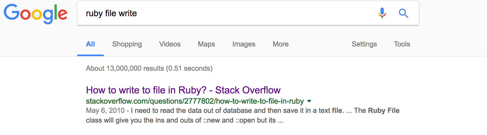
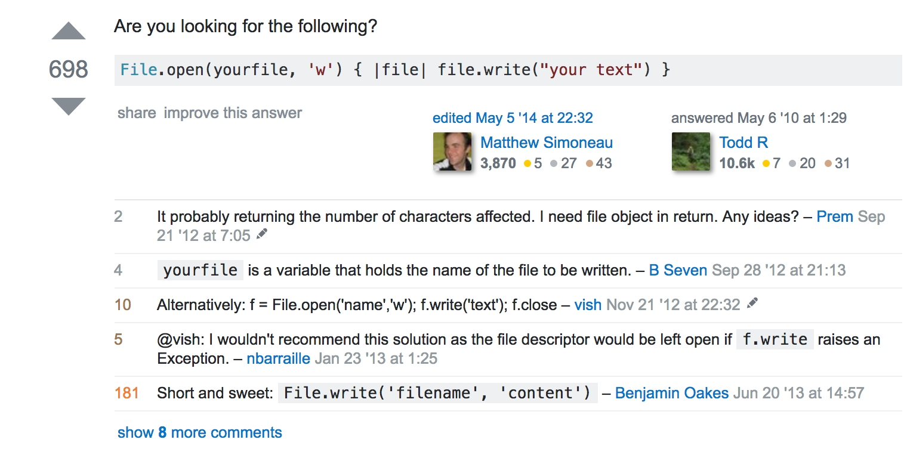
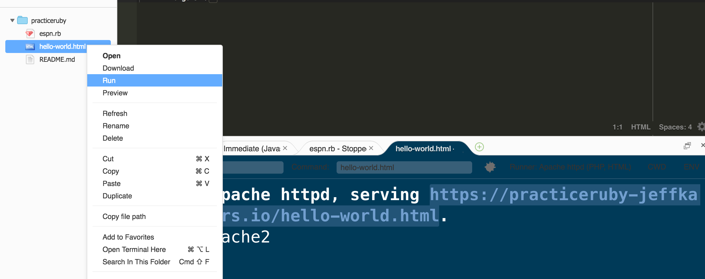

# Ruby to HTML

Alright, so now we have seen how ruby allows us to use logic, to represent our code.  We haven't really seen the payoff of using ruby *yet*, but we will in the next section.

For now, let's focus on how to get our ruby back into HTML so that we can send this to a browser to display our information to a user.  

### HTML is just text

Remember that HTML is just text, or in ruby terms, it is just a string.  And remember that we know how to display that HTML file back to a user, by clicking our `run` button in cloud 9.  

So now we need to see if we can get ruby to write a file for us.

Let's ask the great oracle: Google.



When we click on that result, we see some answers.



The top one looks hard, but the comment at the bottom looks easier: 

```ruby
	File.write('filename', 'content')
```

> Whenever we learn something we are unsure of, it's good to get as quick a feedback loop as possible.  With ruby, that means typing `irb` and opening up our console.  Then we can try out the code.

Type the following into your ruby console.

```ruby
File.write('hello-word.html', 'some content')
```

Then take a look at your `hello-world.html` file.  Did it change?  

Ok, so now we want a way to change our procedure, so does `File.write` belong in a method or a variable?

Sounds like a method to me.

So, now we can put all of this together: 

1. Instead of File.write('hello-word.html', '<p> some content </p>'), we want to replace 'some content' with a word that will produce the name of our individual.
2. We need to `run` our ruby file to get the result.  Go back to the console and type in `ruby espn.rb` Check that it changed the html.
3. Then we need to have our new html file display on our website.  Do so by right clicking (or two finger clicking) on the mac and then click on run.
4. Then go to the website indicated below. 




### One more thing

This is pretty good.  But we can combine this with some HTML tags.  To do this, we take a string like `"<p> </p>"` and combine it with our `full_name` method.  

So maybe we can just do the following: 

```ruby
"<p> full_name </p>"
```

Unfortunately, if we write that to our file, it will literally just print the letters `'<p> full_name </p> '` instead of `<p> 'Oscar Lindberg' <p>` so we need a way to say at this moment, print just normal letters, and at this moment look to some ruby code.  Here is how we do that: 

```ruby
"<p> #{full_name} </p>"
```

What you see above is called string interpolation.  It means that, from inside the string, whenever we see #{} to look for ruby code instead of looking for just normal text.

So now, in our ruby code, we instead write the following: 

```ruby
File.write('hello-word.html', "<h1>NY Rangers </h1><p> #{full_name} </p>") 
``` 

Then when we run the ruby file, it produces the html, and when we run the html, we display the result on our website.